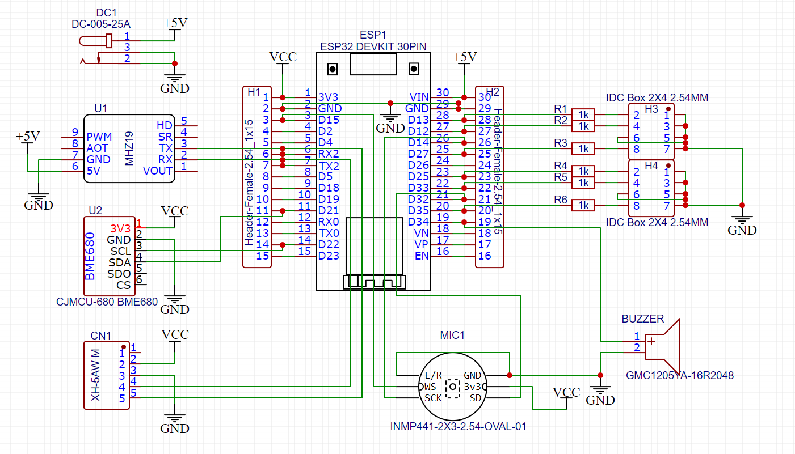

# Classroom-Sensor
Sensor on ESP32 with CO2, MEMS

# Software

## Verwendete Arduino Bibliotheken

### Internet
* [Wifi](https://www.arduino.cc/en/Reference/WiFi)
* [WifiClientSecure](https://github.com/espressif/arduino-esp32/tree/master/libraries/WiFiClientSecure)
* Für MQTT: [PubSubClient](https://pubsubclient.knolleary.net/)
### Sensoren
* [MH-Z19 von Jonathan Dempsey](https://github.com/WifWaf/MH-Z19)
* [Adafruit BME280 Library](https://github.com/adafruit/Adafruit_BME280_Library)

## MQTT-Server
Wir verwenden meinen privaten Mosquitto MQTT-Server **fadenstrahl.de** über den verschlüsselten Port 8883
Die MQTT-Daten können [hier](https://grafana.fadenstrahl.de/d/bWRdm1dMk/environment?orgId=1&refresh=5s) betrachtet werden.

### MQTT-Topics
* igs/environment/deepsleep
* igs/environment/room1/co2
* igs/environment/room1/temp
* igs/environment/room1/hum
* igs/environment/room1/pres
* igs/environment/room1/vol

# Hardware

## Platine

* Außenmaße: 70x70 mm
Die Maße des Feinstaubsensors definieren den Umriss der Platine (70mm x 70mm). Die Löcher (3,2mm) an den richtigen Stellen einplanen damit man den Feinstaubsensor auf die Rückseite der Platine schrauben kann.  

### [Anschluss für LEDs](https://www.aliexpress.com/item/33053059178.html)
LCSC: [C9139](https://lcsc.com/product-detail/IDC-Connectors_BOOMELE-Boom-Precision-Elec-C9139_C9139.html) oder [C492432](https://lcsc.com/product-detail/Pin-Header-Female-Header_XFCN-PZ254R-12-8P_C492432.html)

An die Platine kann man zewimal per Dupont-Kabel entweder
* je eine RGB-LED oder
* je 3 LEDs 
anschließen. Also maximal 6 LEDs.

### Anschluss für Feinstaubsensor [SDS011](https://www.aliexpress.com/item/4000029760504.html)
LCSC: [XH-5AW](https://lcsc.com/product-detail/Wire-To-Board-Wire-To-Wire-Connector_BOOMELE-Boom-Precision-Elec-XH-5AW_C24023.html)

## Mikrocontroller, Sensoren und Aktoren

### ESP32: [Doit 30Pin Version:](https://www.aliexpress.com/item/32959541446.html)

Jeder Pin des ESP32 ist der Flexibilität  halber auf der Platine herausgeführt.
Es gibt zwei mögliche Anschlussmöglichkeiten:
* Single: https://www.aliexpress.com/item/32970948352.html 
* Double: https://www.aliexpress.com/item/32956866217.html 

### CO2-Sensor: [MH-Z19](https://www.aliexpress.com/item/4000212024923.html)

[Datenblatt](https://cdn-reichelt.de/documents/datenblatt/X200/SDS011-DATASHEET.pdf)

### Umweltsensor [BME680](https://www.aliexpress.com/item/4000049700826.html)

### Mikrofon [INMP441](https://www.aliexpress.com/item/32961274528.html)

Zur Lärmpegelmessung.

### [Buzzer](https://www.aliexpress.com/item/32416854447.html)
LCSC: [SEA-12085-16](https://lcsc.com/product-detail/Buzzers_Made-in-China-SEA-12085-16_C2858.html)

## Andere Projekte im Netz

* https://randomnerdtutorials.com/build-an-all-in-one-esp32-weather-station-shield/ 
* https://github.com/kadamski/dust_sensor 
