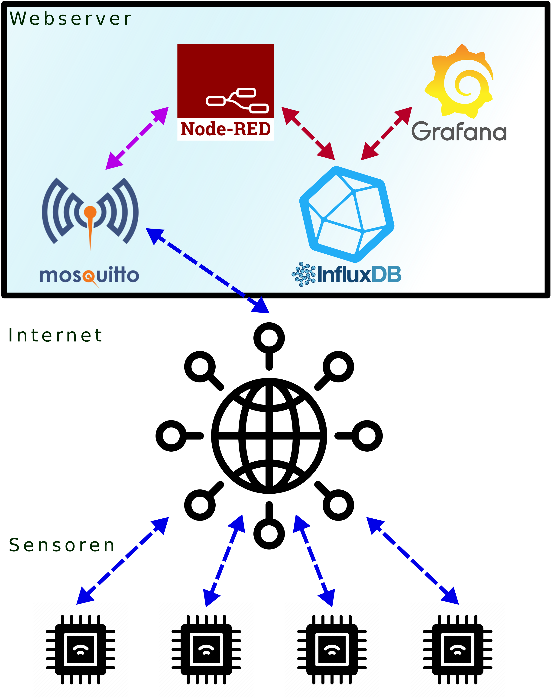
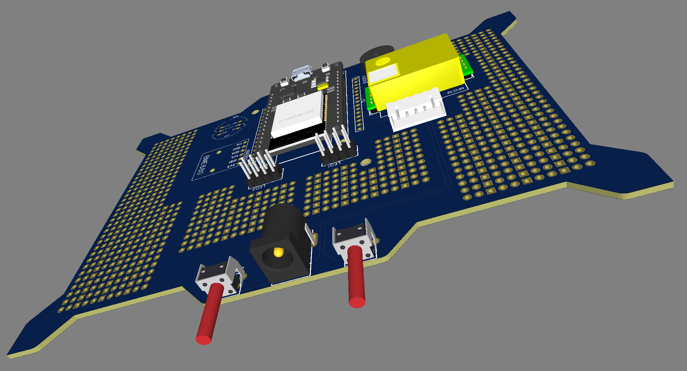
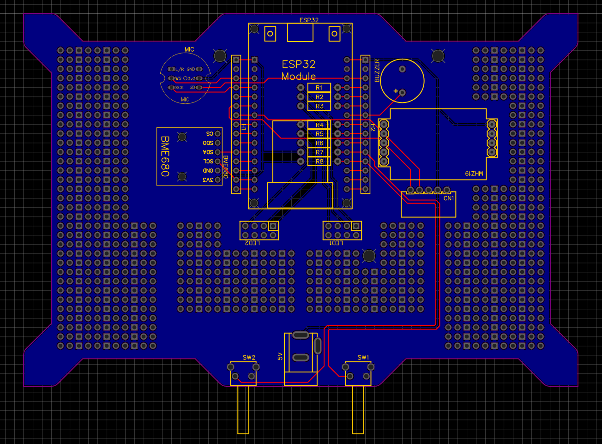
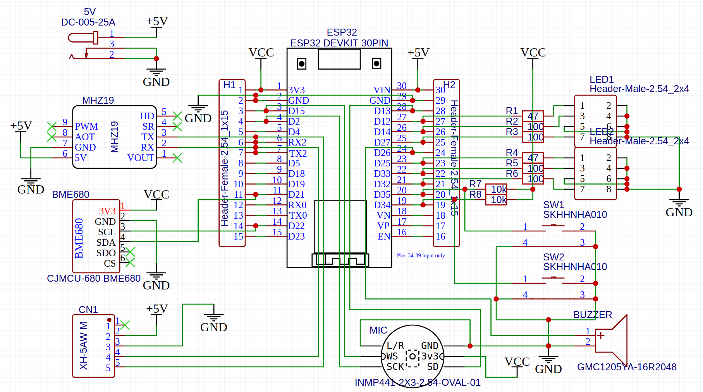

# Classroom-Sensor

Der Classroom-Sensor verwendet einen ESP32-Mikrocontroller mit integriertem wifi-Modul.

Mit den drei Sensoren werden die folgenden Umweltwerte gemessen
* CO₂-Konzentration mit dem MH-Z19
* Lufttemperatur, Luftfeuchtigkeit, Luftdruck und Luftqualität (IAQ) mit dem Bosch BME680
* Lautstärke in Dezibel mit dem INMP441-Mikrofon
sowie zwei Taster, die frei konfiguriert werden können

Die zwei RGB-Leuchtdioden und ein Summer dienen als Aktoren.

Die Platine wird in einem IKEA Bilderrahmen als Gehäuse untergebracht. Die "Frontblende" kann frei gestaltet werden. Dabei werden die LEDs integriert.

[Hier](https://grafana.fadenstrahl.de/d/bWRdm1dMk/environment?orgId=1&refresh=5s) können die Testdaten betrachtet werden.

In der Datei [cred.h](cred.h) müssen die WLAN-Zugangsdaten und URL/Port des MQTT-Servers eingetragen werden.

## ToDo

* Die LEDs werden im Augenblick noch nicht angesteuert. Dazu eignet sich die [jled](https://github.com/jandelgado/jled#static-on-and-off)-Bibliothek.
* Die Taster werden noch nicht unterstützt. Man muss [freeRTOS](https://forum.arduino.cc/index.php?topic=674975.0) richtig einsetzen.

# Software

## Verwendete Arduino Bibliotheken

### Internet
* Für die sichere TLS (SSL) Verbindung zum MQTT-Server: [WifiClientSecure](https://github.com/espressif/arduino-esp32/tree/master/libraries/WiFiClientSecure)
* Für das MQTT-Protokoll: [arduino-mqtt](https://github.com/256dpi/arduino-mqtt)

### Sensoren / Aktoren
* [MH-Z19](https://github.com/WifWaf/MH-Z19)
* [BME680](https://github.com/BoschSensortec/BSEC-Arduino-library)
* [INMP441](https://github.com/ikostoski/esp32-i2s-slm)
* Zukünftig: Für die Steuerung der LEDs: [jled](https://github.com/jandelgado/jled#static-on-and-off)

## Datenfluss

## MQTT-Topics
* igs/environment/deepsleep
* igs/environment/RAUM_ID/co2
* igs/environment/RAUM_ID/temp
* igs/environment/RAUM_ID/hum
* igs/environment/RAUM_ID/pres
* igs/environment/RAUM_ID/gasresistance
* igs/environment/RAUM_ID/vol

Wobei **RAUM_ID** durch eine eindeutige Kennzeichnung des Raumes ersetzt wird. Zu Testzwecken verwende ich *raum1* und *raum2*.

# Hardware

## Platine

Auf der zugehörigen [Projektseite auf oshwlab.com](https://oshwlab.com/Classroom-Sensor/classroom-sensor) können Sie den Schaltplan und die Platine bearbeiten und von jlcpcb fertig lassen.

* Außenmaß:
Die Innenmaße des [Ikea Rahmens Ribba 10x15](https://www.ikea.com/de/de/p/ribba-rahmen-weiss-50378410/) definieren den Umriss der Platine (152.5mm x 102.6mm).
Die Löcher (3,2mm) sind dafür da um optional den Feinstaubsensor auf die Rückseite der Platine anzuschrauben.

### Anschlussmöglichkeiten für die LEDs

Auf der Platine gibt es zwei Anschlussmöglichkeiten für bis zu 6 LEDs. Eine RGB-LED ersetzt 3 LEDs. Es lassen sich also zwei RGB-LEDs anschließen und beliebig programmieren.
Die erste LED könnte die CO₂-Konzentration und die zweite die Lautstärke anzeigen.

Die LEDs kann man an einem beliebigen Platz direkt auf die Platine auflöten indem man für eine RGB-LED vier nebeneinanderstehende freie Lötlöcher auswählt.
Alle Löcher mit quadratischer Lötstelle sind mit GND (Minus) verbunden. Die anderen Löcher (mit runden Lötstellen) sind nicht verbunden.
Für jede LED braucht es also eine Kabelverbindung zu einem der LED Anschlussstellen, die mit LED1 und LED2 beschriftet sind.

Alternativ kann man die LEDs auch mit einem Kabel mit der Platine verbinden, wenn man einen Connector auf die Platine lötet.
Es eignet sich zu Beispiel ein abgewinkelter [2X4P IDC Connector](https://de.aliexpress.com/item/4000113049761.html) oder ein 2x4 Pin Header.
LCSC: [2X4P IDC Connector](https://lcsc.com/product-detail/IDC-Connectors_BOOMELE-Boom-Precision-Elec-C9139_C9139.html) oder [C492432](https://lcsc.com/product-detail/Pin-Header-Female-Header_XFCN-PZ254R-12-8P_C492432.html)

### Anschluss für Feinstaubsensor (SDS011)

Dieser Anschluss ist für den Classroom-Sensor absolut optional.
Dabei Feinstaubsensor handelt es sich um ein total anderes Projekt, dass sich mit dieser Platine ebenfalls umsetzten lässt.

[Datenblatt des Feinstaubsensors](https://cdn-reichelt.de/documents/datenblatt/X200/SDS011-DATASHEET.pdf)

#### Bezugsquellen
* Sensor: [AliExpress](https://de.aliexpress.com/item/32606349048.html)
* Buchse: [AliExpress](https://www.aliexpress.com/item/4000029760504.html)
* LCSC [XH-5AW](https://lcsc.com/product-detail/Wire-To-Board-Wire-To-Wire-Connector_BOOMELE-Boom-Precision-Elec-XH-5AW_C24023.html)

## Mikrocontroller, Sensoren und Aktoren

### ESP32 (Doit 30Pin Version)

Jeder Pin des ESP32 Entwicklungsboards ist auf der Platine herausgeführt.
Bei Bedarf können zwei [einreihige Pin-Buchsen](https://www.aliexpress.com/item/32970948352.html) (15 Pins pro Seite) aufgelötet werden.

#### Bezugsquelle
* [AliExpress](https://www.aliexpress.com/item/32959541446.html)

### CO₂-Sensor: (MH-Z19)

#### Bezugquelle
* [AliExpress](https://www.aliexpress.com/item/4000212024923.html)

### Umweltsensor (BME680)

#### Bezugsquelle
* [AliExpress](https://www.aliexpress.com/item/4000049700826.html)

### Mikrofon (INMP441)

Zur Lärmpegelmessung.

#### Bezugsquelle
* [AliExpress](https://www.aliexpress.com/item/32961274528.html)

### Summer (Buzzer)

#### Bezugsquellen
* [AliExpress](https://www.aliexpress.com/item/32416854447.html)
* LCSC: [SEA-12085-16](https://lcsc.com/product-detail/Buzzers_Made-in-China-SEA-12085-16_C2858.html)

### Taster

#### Bezugsquellen
* [AliExpress](https://de.aliexpress.com/item/4000800019378.html)
* LCSC: [SKHHNHA010](https://lcsc.com/product-detail/Tactile-Switches_ALPSALPINE-SKHHNHA010_C219779.html)

### RGB-LED

Man hat die Wahl zwischen zwei RGB Leuchtdioden mit *gemeinsamer Kathode* oder bis zu 6 einzelnen LEDs. Man kann auch eine RGB LED und 3 einzelne LEDs verwenden.
Ich rate zu diffusen LEDs, da sich die Farben besser mischen.

#### Bezugsquelle
* [AliExpress](https://de.aliexpress.com/item/32278313170.html)

### Strombuchse für 5V

#### Bezugsquelle
* [AliExpress](https://de.aliexpress.com/item/32730260523.html)

## Links zu weiteren Projekten

* https://randomnerdtutorials.com/build-an-all-in-one-esp32-weather-station-shield/ 
* https://github.com/kadamski/dust_sensor 
* https://www.umwelt-campus.de/forschung/projekte/iot-werkstatt/ideen-zur-corona-krise-1
* http://steinlaus.de/stinkt-das-hier-teil-1-mit-dem-bosch-bme680/
